# Software architecture

| Field | Value |
| --- | --- |
| Document | Software architecture description |
| Version | 1.2 |
| Status | Approved |
| Owner | fastapi-locale contributors |
| Last updated | 2026-10-04 |

## 1. Purpose and scope

This document describes the structure of fastapi-locale: its context, its parts, how they work together at
runtime, and how it meets the quality requirements. It builds on the
[SRS](../requirements/software-requirements-specification.md) and the
[domain model](../modeling/domain-model.md). Decisions are recorded in the [ADRs](../adr/README.md); the
[detailed design](../design/detailed-design.md) goes down to classes and modules.

## 2. Architectural drivers

The requirements that shape the architecture most:

| Driver | Source | Effect on the architecture |
| --- | --- | --- |
| Localized 422 errors | ERR-01 to ERR-08 | The locale must be known before validation fails, so it is resolved in middleware. |
| Lazy text in models and errors | LZY-01 to LZY-05 | A dedicated type with Pydantic hooks, and our own HTTP exception handler. |
| User's saved language | LOC-13 | The request locale is a mutable holder that dependencies can change. |
| Correct under async and threads | C-02, NFR-07 | State lives in a context variable, never in globals or thread locals. |
| No I/O in requests | C-03, NFR-02 | Catalogs are loaded once and are read only afterwards. |
| Security of request input | NFR-03 to NFR-05 | Locale values are only lookup keys; placeholders are substituted by name only. |
| Survive FastAPI and Pydantic releases | NFR-08, NFR-09 | A small framework-free core, and tests that detect upstream changes. |

## 3. System context

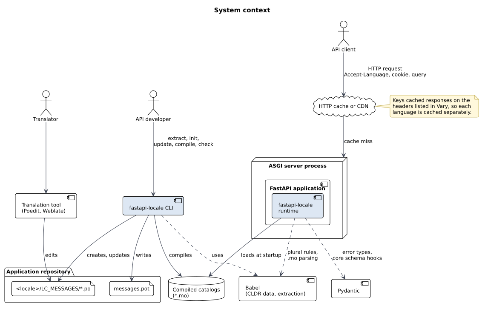

fastapi-locale has two parts:

- **The runtime**, imported by the FastAPI application. It resolves locales, translates, and localizes
  error responses.
- **The CLI**, used by developers and CI to maintain catalogs. It never runs inside the application.

It depends on Babel for catalog parsing, plural rules and message extraction, and on Pydantic for error
types and serialization hooks. It has no network access and no database.

A shared HTTP cache or CDN in front of the application must keep one copy per language. The runtime makes
this safe by listing the headers it reads in `Vary` (LOC-11).

## 4. Building blocks

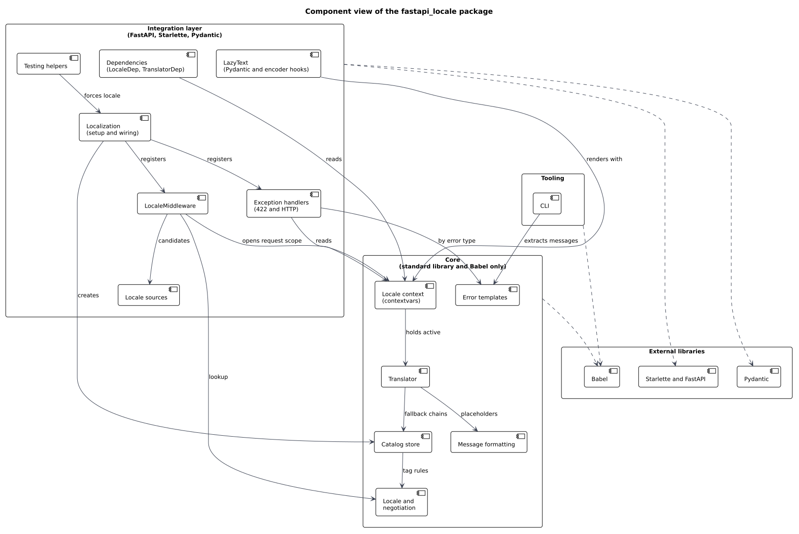

The package is split into two layers, plus the CLI:

- **Core** uses only the standard library and Babel. It holds locale parsing and negotiation, the catalog
  store, the translator, message formatting, the error templates and the locale context. It can be unit
  tested without FastAPI and would work in any Python program.
- **Integration layer** connects the core to FastAPI, Starlette and Pydantic: the middleware, locale
  sources, exception handlers, dependencies, `LazyText` and test helpers. `Localization` wires everything
  into an application with one call.
- **CLI** wraps Babel's extraction and compilation and adds the `check` command.

Interfaces offered to applications:

| Interface | Form | Used for |
| --- | --- | --- |
| Setup | `Localization(config).install(app)` | Registers middleware and handlers (DI-01). |
| Translation functions | `gettext`, `ngettext`, `pgettext`, `npgettext`, `d` variants, lazy variants | UC-03, UC-04 |
| Dependencies | `LocaleDep`, `TranslatorDep` | Route code; replaceable with `dependency_overrides` (DI-02, DI-03). |
| Locale control | `set_locale()`, `use_locale()` | UC-05 and temporary switches. |
| Exception handlers | `validation_exception_handler`, `http_exception_handler` | Installed by setup, or composed by the application. |
| Extension point | `LocaleSource` protocol | Custom locale sources (LOC-06). |
| Command line | `fastapi-locale extract, init, update, compile, check` | UC-06, UC-09 |

## 5. Runtime views

### 5.1 Startup

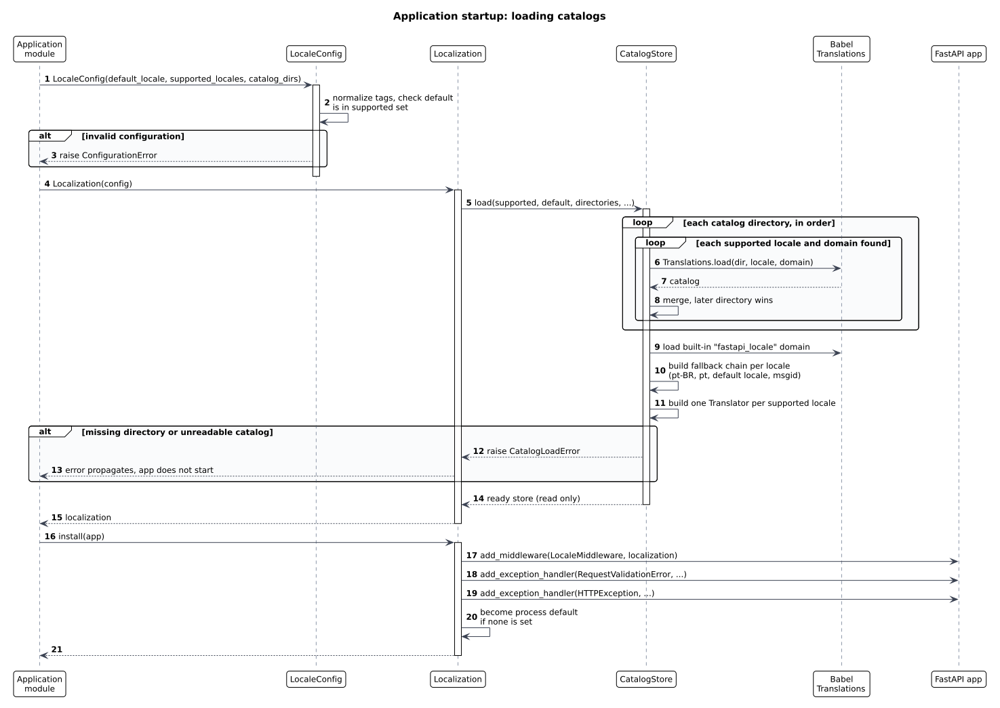

Configuration is validated first, then every catalog directory is read in order, with later directories
overriding earlier ones. The library's own error catalog is loaded before the application's, which is how
applications override built-in messages. A translator is built for each supported locale. Any failure stops
startup with a clear error (ADR-0008).

### 5.2 A normal request

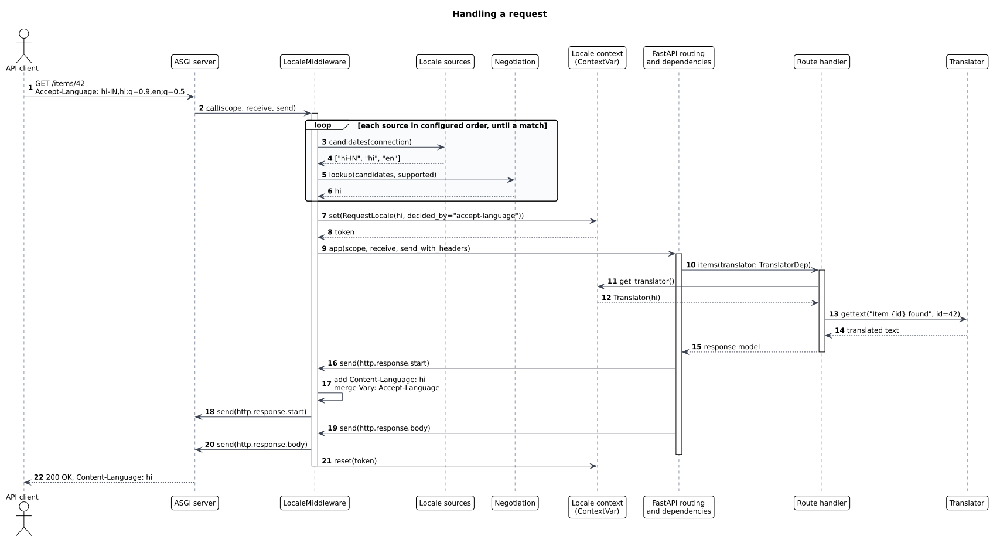

The middleware resolves the locale before routing, stores a `RequestLocale` in the context variable, and
wraps `send` so it can add `Content-Language` and `Vary` when the response starts. The context variable is
reset when the request ends, including when it fails.

### 5.3 Validation error with the user's language

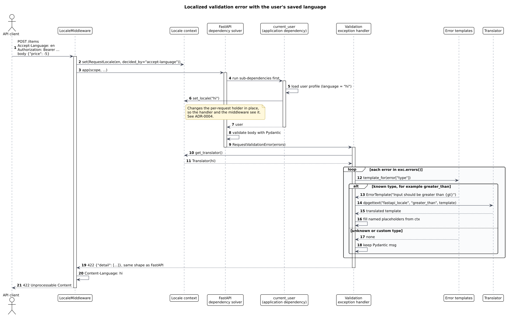

FastAPI runs a route's dependencies before validating its body. When an application dependency calls
`set_locale()` with the user's language, the 422 handler and the `Content-Language` header both use it
(ADR-0004).

### 5.4 Lazy text

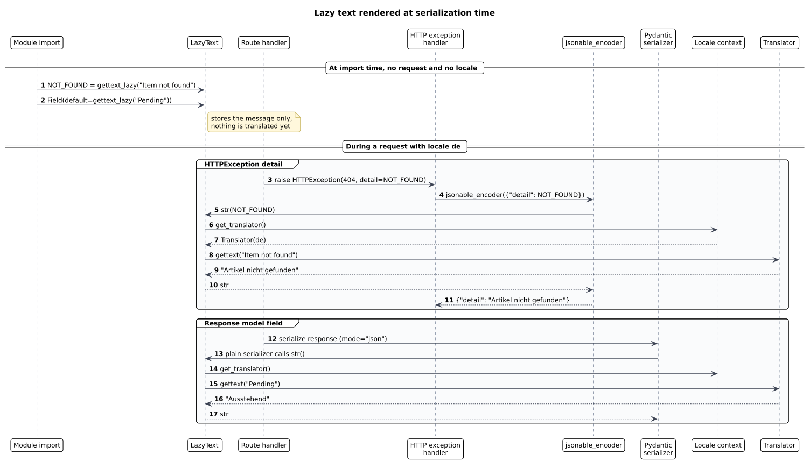

Lazy text is created at import time with no locale and translated when it is serialized. Serialization
always happens inside the request, so it uses the request locale (ADR-0005).

### 5.5 Locale resolution

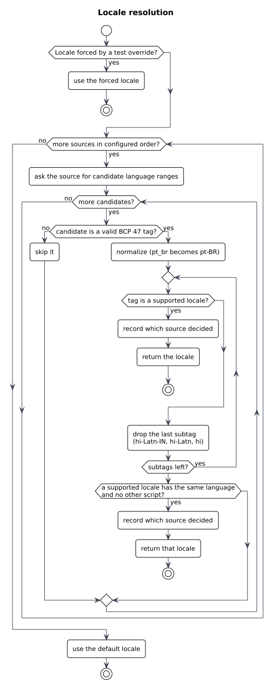

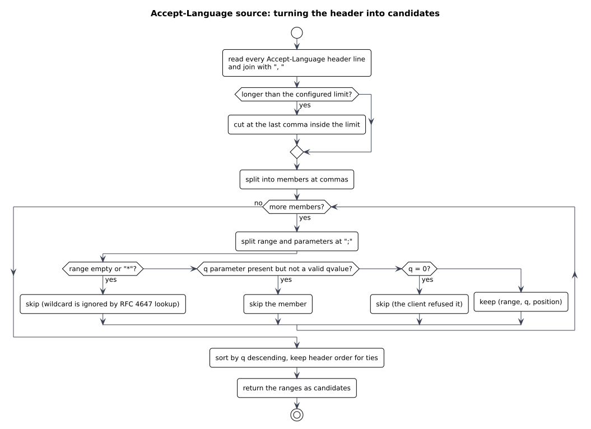

Sources are asked in the configured order; the first candidate that matches a supported locale wins.
Matching is RFC 4647 lookup, then another region of the same language (ADR-0012). The `Accept-Language`
source parses the header as RFC 9110 defines it, drops malformed members and refused (`q=0`) ranges, and
caps the input length.

### 5.6 API documentation

FastAPI builds the OpenAPI schema once. The first request for a locale, usually Swagger UI fetching
`/openapi.json` with the browser's `Accept-Language`, translates the values of `title`, `summary` and
`description` keys and caches the result for that locale (ADR-0009). Lookup tries the `openapi` message
context, then the plain message, then the library's catalog for FastAPI's own text.

### 5.7 Message lookup

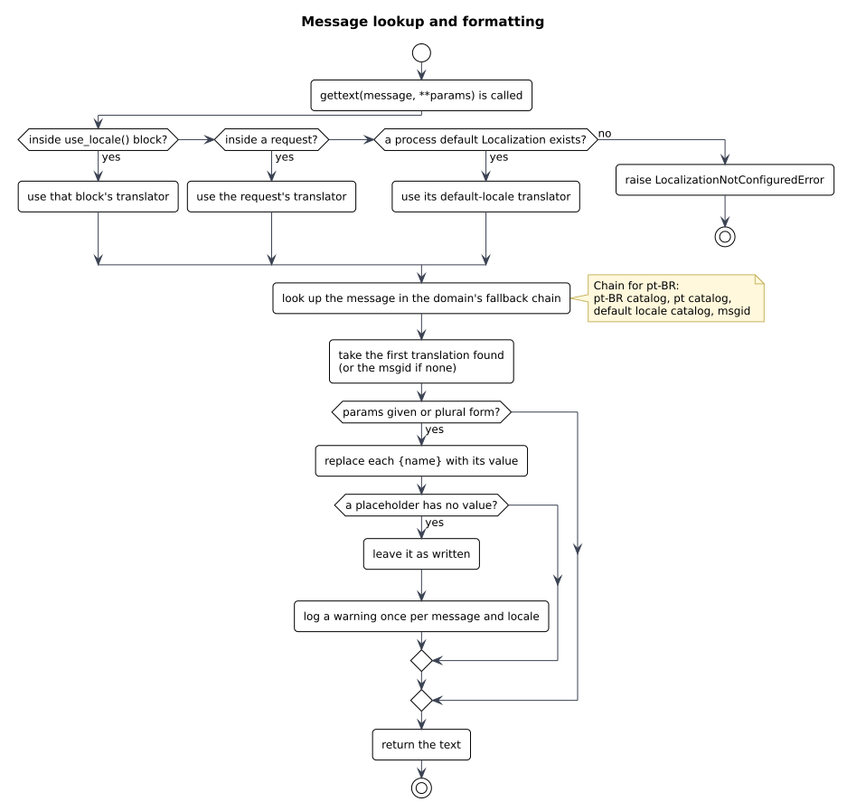

### 5.8 Translation workflow

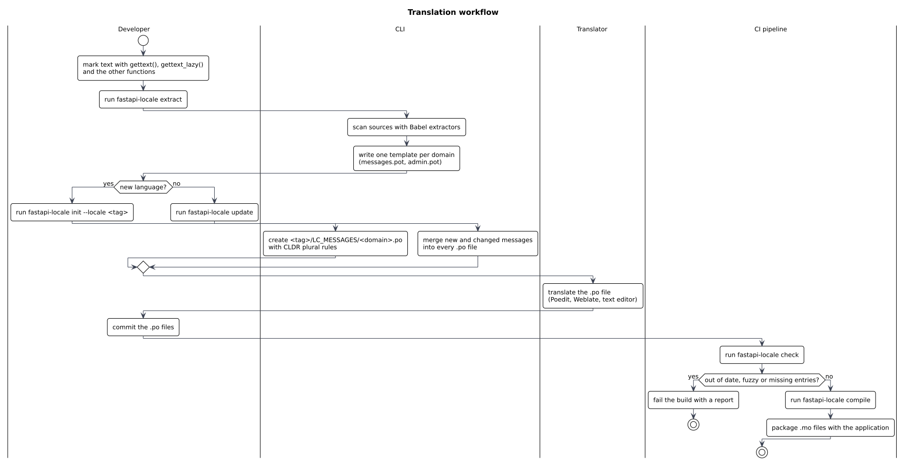

## 6. Deployment view

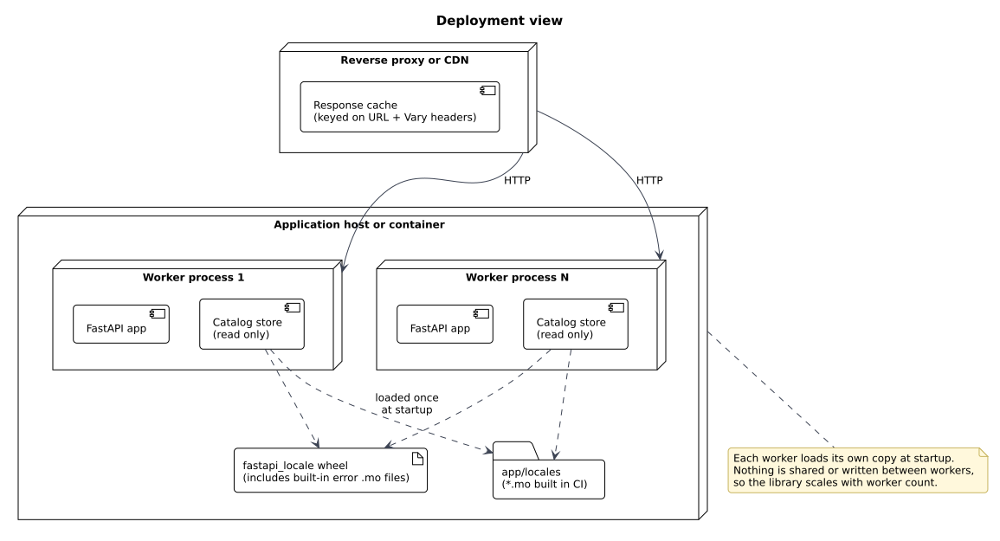

Each worker process loads its own read-only copy of the catalogs. Workers share nothing, so the library adds
no coordination and scales with the number of workers. The built-in error catalogs ship inside the wheel;
application catalogs are compiled in CI and shipped with the application.

## 7. Cross-cutting concerns

### 7.1 Concurrency

All request state is in one context variable holding a per-request object (ADR-0003). Catalogs and
translators are read only after loading and are safe to share between threads and tasks.

### 7.2 Error handling

- Configuration and catalog errors raise at setup, never during a request.
- During a request, catalog content can never cause an error: missing translations fall back to the msgid,
  and missing placeholder values are left as written and logged (NFR-06).
- Application mistakes raise clear exceptions: `set_locale()` with an unsupported locale raises
  `UnsupportedLocaleError`; translating with no `Localization` set up raises
  `LocalizationNotConfiguredError`.

### 7.3 Security

| Threat | Mitigation | Requirement |
| --- | --- | --- |
| Path traversal through a locale value (`../../etc`) | Values are validated as BCP 47 tags and only matched against the configured set. File paths are built from configuration only, at setup. | NFR-03 |
| CPU cost from a huge `Accept-Language` header | Input is cut at a fixed length before parsing. | NFR-04 |
| A translated string reading data (`{obj.__class__}`) | Placeholders are replaced by name only; no `str.format`. | NFR-05 |
| Wrong language served from a shared cache | `Vary` lists every header the sources read. | LOC-11 |
| Personal data in logs | Header values and user data are logged only at debug level, never message parameters. | NFR-10 |

### 7.4 Observability

The library logs through the standard `logging` module under the `fastapi_locale` logger:

- INFO at setup: loaded locales, domains and message counts.
- WARNING for translation problems (missing placeholder values), once per message and locale.
- DEBUG for each resolution: which source decided and the resulting locale.

The resolved locale and the deciding source are available on `request.state`, so applications can add
them to their own access logs or traces.

### 7.5 Performance

Per request, the middleware parses a few short values and does dictionary lookups against a precomputed
table. Each message lookup is a dictionary lookup along a short, precomputed fallback chain. The budget is
50 microseconds median for resolution (NFR-01), checked by a benchmark in CI.

## 8. Quality requirements and how they are met

| Requirement | Tactic |
| --- | --- |
| NFR-01, NFR-02 performance | Precomputed translators and fallback chains; no I/O or object creation per lookup. |
| NFR-03 to NFR-05 security | Section 7.3. |
| NFR-06 reliability | Fallback to msgid; formatting never raises. |
| NFR-07 isolation | Context variable with a per-request holder, reset with its token. |
| NFR-08, NFR-09 compatibility | Version matrix in CI; tests that detect new Pydantic error types and FastAPI encoder changes. |
| NFR-11 maintainability | Framework-free core; import-linter layering rules; strict typing. |
| NFR-12 usability | One setup call with defaults for sources and handlers. |

## 9. Risks and technical debt

| ID | Risk | Likelihood | Impact | Response |
| --- | --- | --- | --- | --- |
| R-01 | FastAPI changes `ENCODERS_BY_TYPE`, which lazy text relies on. | Low | Medium | Test in CI against each supported FastAPI version (ADR-0005). |
| R-02 | pydantic-core adds or renames error types. | High | Low | Test lists all types and fails on a missing template; unknown types fall back to Pydantic's text. |
| R-03 | `list_all_errors` is not public Pydantic API. | Medium | Low | Used only in tests. |
| R-04 | Some `ctx` values are pre-rendered English (`literal_error`). | Certain | Low | Documented limit; revisit with list formatting (FMT-02). |
| R-05 | Translating the finished OpenAPI schema may miss or wrongly translate text. | Medium | Low | Prototype confirmed the approach; the `openapi` message context lets translators separate schema text, and data keys such as `default` are never touched (ADR-0009). |
| R-06 | A user dependency that fails its own validation does not run, so its locale is not applied. | Low | Low | Documented limit (ADR-0004). |

## 10. Decisions

See the [ADR index](../adr/README.md). The main ones behind this architecture are ADR-0003 (context
variable with a per-request holder), ADR-0004 (middleware resolves, dependencies refine) and ADR-0005 (lazy
text type).
