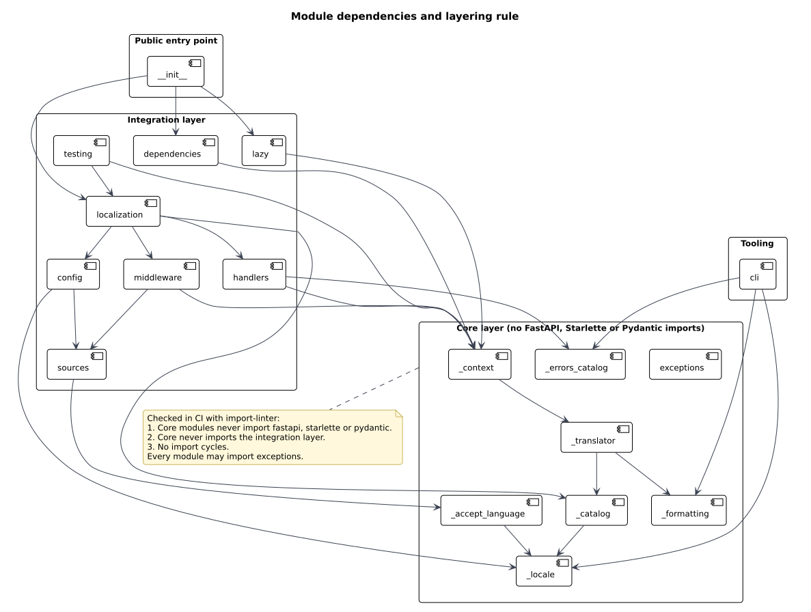
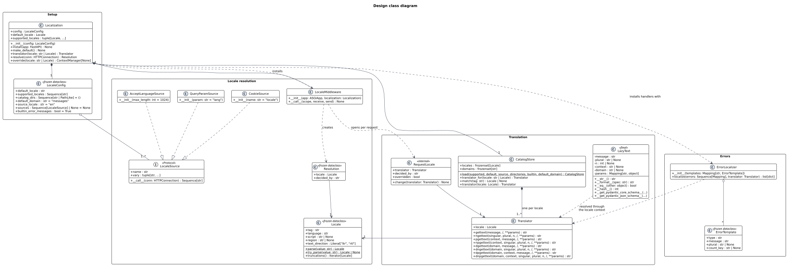

# Detailed design

| Field | Value |
| --- | --- |
| Document | Detailed design |
| Version | 1.0 |
| Status | Approved |
| Owner | Kapil Dagur |
| Last updated | 2026-09-28 |

## 1. Purpose

This document specifies the modules, classes and public API of fastapi-locale closely enough to implement
and test them. It follows the [architecture](../architecture/software-architecture.md) and the
[ADRs](../adr/README.md). Names used here are the names used in the code.

## 2. Package layout

```text
src/fastapi_locale/
    __init__.py            public API, re-exported from the modules below
    py.typed
    config.py              LocaleConfig
    exceptions.py          exception hierarchy
    _locale.py             Locale value object, tag parsing, RFC 4647 truncation
    _accept_language.py    Accept-Language parsing
    _catalog.py            CatalogStore: loading, merging, fallback chains
    _translator.py         Translator
    _formatting.py         named placeholder substitution
    _context.py            RequestLocale, get_locale, get_translator, set_locale, use_locale
    _errors_catalog.py     ErrorTemplate table, one entry per Pydantic error type
    sources.py             LocaleSource protocol and built-in sources
    middleware.py          LocaleMiddleware
    lazy.py                LazyText and the *_lazy functions
    handlers.py            validation and HTTP exception handlers, ErrorLocalizer
    dependencies.py        LocaleDep, TranslatorDep
    localization.py        Localization
    testing.py             pytest marker and helpers
    cli/                   fastapi-locale command
    locales/               built-in error catalogs as .pot and .po source
```

Modules whose names start with an underscore are internal. Everything an application needs is importable
from `fastapi_locale`.

## 3. Layering rules



1. Core modules (`_locale`, `_accept_language`, `_catalog`, `_translator`, `_formatting`, `_context`,
   `_errors_catalog`, `exceptions`) never import FastAPI, Starlette or Pydantic.
   `config` belongs to the integration layer because it holds locale sources, which read Starlette's
   `HTTPConnection`. The core receives plain values from it.
2. Core modules never import integration modules.
3. There are no import cycles.

These rules are checked in CI with import-linter (ADR-0010).

## 4. Class design



### 4.1 LocaleConfig

A frozen dataclass, validated in `__post_init__`.

| Field | Type | Default | Rule |
| --- | --- | --- | --- |
| `default_locale` | `str` | required | Valid tag; must be in `supported_locales`. |
| `supported_locales` | `Sequence[str]` | required | At least one; valid tags; duplicates after normalization are an error. |
| `catalog_dirs` | `Sequence[str or PathLike]` | `()` | Each must be an existing directory. |
| `default_domain` | `str` | `"messages"` | Non-empty; letters, digits, `_`, `-`, `.`. |
| `source_locale` | `str` | `"en"` | The language msgids are written in; needs no catalog (CAT-06). |
| `sources` | `Sequence[LocaleSource] or None` | `None` | `None` means query `lang`, cookie `locale`, then `Accept-Language`. |
| `builtin_error_messages` | `bool` | `True` | Load the library's error catalogs. |

Any rule violation raises `ConfigurationError` naming the field.

### 4.2 Locale

A frozen dataclass with `tag`, `language`, `script`, `region`.

- `Locale.parse(value)` accepts `_` or `-` separators and any case, validates the BCP 47 shape
  (`language[-script][-region][-variant...]`), and normalizes: language lower case, script title case,
  region upper case (`zh_hant_tw` becomes `zh-Hant-TW`). Invalid input raises `ValueError`.
- `Locale.try_parse(value)` returns `None` instead of raising. Sources use it for request input.
- `truncations()` yields the tag and then shorter tags, dropping single-letter subtags with the subtag after
  them as RFC 4647 section 3.4 says: `zh-Hant-TW`, `zh-Hant`, `zh`.
- `text_direction` comes from Babel's locale data.
- `str(locale)` is the tag.

### 4.3 Locale sources

```python
class LocaleSource(Protocol):
    name: str                     # recorded as RequestLocale.decided_by
    vary: tuple[str, ...]         # request headers this source reads

    def __call__(self, conn: HTTPConnection) -> Sequence[str]: ...
```

| Source | Reads | `vary` | Returns |
| --- | --- | --- | --- |
| `QueryParamSource(param="lang")` | `?lang=hi` | `()` | `[value]` or `[]` |
| `CookieSource(name="locale")` | cookie | `("Cookie",)` | `[value]` or `[]` |
| `AcceptLanguageSource(max_length=1024)` | header | `("Accept-Language",)` | ranges by preference |
| `PathPrefixSource()` | `/hi/...` | `()` | planned (LOC-05) |

A source must be fast, must not do I/O, and must not raise. A custom source that raises is logged and
skipped. Sources are sync on purpose: anything that needs I/O, like reading the user's profile, belongs in
a dependency that calls `set_locale()` (ADR-0004).

### 4.4 Accept-Language parsing

As shown in the activity diagram in the architecture document:

1. Join all `Accept-Language` header lines with `", "`.
2. If longer than `max_length`, cut at the last comma inside the limit.
3. Split members at commas. For each member, split the range from its parameters at `;`.
4. Skip empty ranges and `*`. If a `q` parameter exists and does not match the RFC 9110 qvalue grammar
   `0(\.\d{0,3})? | 1(\.0{0,3})?`, skip the member. Skip members with `q=0`.
5. Stable sort by `q`, highest first, so equal weights keep header order.

### 4.5 Negotiation

```text
for source in sources:
    for candidate in source(conn):
        locale = Locale.try_parse(candidate)
        if locale is None: continue
        for tag in locale.truncations():
            if tag in supported: return Resolution(supported[tag], source.name)
return Resolution(default_locale, "default")
```

`supported` is a dictionary from normalized tag to `Locale`, built once. The result for a given candidate
list does not depend on anything but the configuration, so it is easy to test exhaustively.

### 4.6 CatalogStore

`CatalogStore.load(supported, default, source, directories, builtin, default_domain)` receives plain
values from `LocaleConfig`, so the core never depends on the integration layer. It:

1. Build the directory list: the built-in `locales` directory first (if `builtin_error_messages`), then
   `config.catalog_dirs` in order.
2. For the built-in directory, read each `fastapi_locale.po` with Babel and compile it in memory. For each
   application directory, each supported locale, and each `<domain>.mo` file found under
   `<dir>/<locale dir>/LC_MESSAGES/`, load it with `babel.support.Translations.load`. Locale directory names
   are matched to supported locales after normalization (`pt_BR` and `pt-BR` are the same).
3. Merge catalogs for the same locale and domain in directory order, so later directories win (CAT-04).
4. For each supported locale and domain, build the fallback chain: the locale's own catalog, then catalogs
   for each shorter tag from `truncations()`, then the default locale's catalog, joined with
   `add_fallback`. A missing link is skipped. The end of the chain returns the msgid.
5. Build one `Translator` per supported locale.
6. Log the loaded locales, domains and message counts at INFO. Log a WARNING for a supported locale, other
   than the source locale, that has no catalog in the default domain.

Any `OSError` or parse error is raised as `CatalogLoadError` with the file path.

### 4.7 Translator

Immutable. Holds its `Locale` and a mapping from domain to fallback chain.

| Method | Signature |
| --- | --- |
| `gettext` | `(message, /, **params) -> str` |
| `ngettext` | `(singular, plural, n, /, **params) -> str` |
| `pgettext` | `(context, message, /, **params) -> str` |
| `npgettext` | `(context, singular, plural, n, /, **params) -> str` |
| `dgettext` | `(domain, message, /, **params) -> str` |
| `dngettext` | `(domain, singular, plural, n, /, **params) -> str` |
| `dpgettext` | `(domain, context, message, /, **params) -> str` |
| `dnpgettext` | `(domain, context, singular, plural, n, /, **params) -> str` |

Positional-only message arguments leave every keyword name free for placeholders. In plural functions `n`
is also available as the placeholder `{n}` unless `params` sets it. An unknown domain behaves like an empty
catalog. The module-level functions of the same names call the active translator.

### 4.8 Message formatting

`format_message(template, params)` replaces `{identifier}` with `str(params[identifier])`, turns `{{` and
`}}` into literal braces, and leaves anything else untouched. A missing name is left as written and logged
once per message and locale (ADR-0007). With no params, the template is returned unchanged.

### 4.9 Locale context

```python
_current: ContextVar[RequestLocale | None]

def get_locale() -> Locale: ...
def get_translator() -> Translator: ...
def set_locale(locale: str | Locale) -> Locale: ...
def use_locale(locale: str | Locale) -> ContextManager[Translator]: ...
```

- `get_translator()` returns, in order: the innermost `use_locale()` translator, the request's translator,
  the process default `Localization`'s default translator. With none of them it raises
  `LocalizationNotConfiguredError`.
- `set_locale()` works only inside a request. It resolves the value with the same lookup as negotiation
  (so `hi-IN` becomes `hi`), changes the `RequestLocale` in place, sets `overridden`, and returns the
  locale. An unsupported value raises `UnsupportedLocaleError`. Outside a request it raises
  `LocalizationNotConfiguredError` with a hint to use `use_locale()`.
- `use_locale()` sets a new `RequestLocale` for the block and restores the previous value with its token,
  also when the block raises. It does not change the response's `Content-Language`.
- The process default is the first `Localization` that is installed, or the one passed to
  `Localization.make_default()`.

### 4.10 LocaleMiddleware

Pure ASGI. For `http` and `websocket` scopes:

1. If a test override is active on the `Localization`, use it; otherwise run negotiation.
2. Create a `RequestLocale`, store it in `scope["state"]["locale"]`, and set the context variable.
3. Call the application with a wrapped `send`. On `http.response.start`, add `Content-Language` with the
   current locale unless the application already set one, and merge the union of all sources' `vary`
   values into any existing `Vary` header, without duplicates and ignoring case.
4. Reset the context variable in `finally`.

`lifespan` scopes pass through untouched.

### 4.11 LazyText

As decided in ADR-0005.

| Behaviour | Rule |
| --- | --- |
| `str(x)`, `format(x, spec)` | Translate with the active translator, then apply `spec`. |
| `x == y` | True only for another `LazyText` with the same message, plural, n, context, domain and params. |
| `hash(x)` | Hash of message, plural, context and domain. Params are left out so unhashable values are allowed. |
| `repr(x)` | `LazyText('Item not found')`, never translated. |
| Pydantic validation | Accepts `LazyText` (kept) or `str` (kept as `str`). |
| Pydantic serialization | JSON mode: `str(x)`. Python mode: `x` itself. |
| JSON schema | `{"type": "string"}` |
| `jsonable_encoder` | Registered in `ENCODERS_BY_TYPE` as `str`. |
| `Any` and `object` positions | `__pydantic_serializer__` renders `str(x)`, for routes FastAPI serializes with Pydantic. |
| Pickle | `__reduce__` stores the constructor arguments. |

`LazyText` does not support `+`, `%` or slicing. Code that needs a string calls `str()` at the point where
the locale is known.

### 4.12 Error localization

`ErrorTemplate(type, message, plural=None, count_key=None)`. The table in `_errors_catalog.py` has one entry
per pydantic-core error type. Examples:

| type | message | plural | count_key |
| --- | --- | --- | --- |
| `missing` | `Field required` | | |
| `greater_than` | `Input should be greater than {gt}` | | |
| `string_too_short` | `String should have at least {min_length} character` | `String should have at least {min_length} characters` | `min_length` |
| `value_error` | `Value error, {error}` | | |

`ErrorLocalizer.localize(errors, translator)` returns new dictionaries. For each error:

1. Find the template for `error["type"]`. If none, keep the error as it is.
2. Translate with `dnpgettext("fastapi_locale", type, message, plural, n)` when the template has a plural and
   `ctx[count_key]` is an integer; otherwise `dpgettext("fastapi_locale", type, message)`.
3. Fill placeholders from `ctx`, converting values with `str()`.
4. Replace `msg`; copy every other key unchanged.

### 4.13 Exception handlers

`validation_exception_handler(request, exc)` returns
`JSONResponse(status_code=422, content={"detail": jsonable_encoder(localized_errors)})`, the same shape as
FastAPI's default.

`http_exception_handler(request, exc)` mirrors FastAPI's default: no body for status codes that do not
allow one, otherwise `{"detail": jsonable_encoder(exc.detail)}` with the exception's headers. Running
`detail` through `jsonable_encoder` is what renders `LazyText`.

`install()` registers both, but leaves alone any handler the application registered earlier for the same
exception. Applications with their own handlers can call these functions from them.

### 4.14 Localization

```python
class Localization:
    def __init__(self, config: LocaleConfig) -> None: ...     # validates, loads catalogs
    def install(self, app: FastAPI) -> None: ...               # middleware, handlers, app.state
    def make_default(self) -> None: ...                        # process default for non-request code
    def translator(self, locale: str | Locale) -> Translator: ...
    def resolve(self, conn: HTTPConnection) -> Resolution: ...
    def override(self, locale: str | Locale) -> ContextManager[None]: ...   # tests
```

`install()` is idempotent for the same application and raises `ConfigurationError` if the application
already has a different `Localization`.

### 4.15 Dependencies

```python
LocaleDep = Annotated[Locale, Depends(current_locale)]
TranslatorDep = Annotated[Translator, Depends(current_translator)]
```

The providers `current_locale` and `current_translator` are small async functions that read the locale
context. They are async because FastAPI runs sync dependencies in its thread pool, which would add a
thread hop to every request. `app.dependency_overrides[current_translator]` replaces them in tests
(DI-03).

### 4.16 Exceptions

```text
LocalizationError
    ConfigurationError
    CatalogLoadError
    UnsupportedLocaleError
    LocalizationNotConfiguredError
```

All carry a message that names what to change. None of them is raised because of request input.

## 5. Public API example

```python
from fastapi import FastAPI, HTTPException
from pydantic import BaseModel

from fastapi_locale import LazyText, LocaleConfig, Localization, TranslatorDep, gettext_lazy

i18n = Localization(LocaleConfig(default_locale="en", supported_locales=["en", "hi", "de"],
                                 catalog_dirs=["app/locales"]))
app = FastAPI()
i18n.install(app)

NOT_FOUND = gettext_lazy("Item not found")


class Item(BaseModel):
    name: str
    status: LazyText = gettext_lazy("Pending")


@app.get("/items/{item_id}")
def read_item(item_id: int, tr: TranslatorDep) -> Item:
    if item_id != 1:
        raise HTTPException(status_code=404, detail=NOT_FOUND)
    return Item(name=tr.gettext("Sample item"))
```

## 6. Testing helpers

- `Localization.override("hi")` forces every request in the block to `hi`.
- `use_locale("hi")` for code called directly.
- The pytest plugin, enabled with `pytest_plugins = ["fastapi_locale.testing"]`, adds a
  `@pytest.mark.locale("hi")` marker that runs the test body inside `use_locale`. It is opt-in so installing
  the library never changes other projects' test runs.

## 7. Command line tool

`fastapi-locale <command>`, configured in `pyproject.toml`:

```toml
[tool.fastapi-locale]
sources = ["app"]
locales_dir = "app/locales"
domain = "messages"
locales = ["hi", "de"]
```

| Command | Action |
| --- | --- |
| `extract` | Write `<locales_dir>/<domain>.pot` from `sources`, using the keywords below. |
| `init --locale TAG` | Create a `.po` file for a new locale with CLDR plural rules. |
| `update` | Merge the template into every `.po` file. |
| `compile` | Compile `.po` to `.mo`; `--strict` fails on fuzzy entries. |
| `check` | Report stale, missing, fuzzy and obsolete entries, missing `Plural-Forms`, and placeholder mismatches. |

Exit codes: 0 success, 1 problems found, 2 usage or configuration error.

Extraction keywords: `gettext`, `ngettext:1,2`, `pgettext:1c,2`, `npgettext:1c,2,3`, `dgettext:2`,
`dngettext:2,3`, `dpgettext:2c,3`, `dnpgettext:2c,3,4`, `gettext_lazy`, `ngettext_lazy:1,2`,
`pgettext_lazy:1c,2`, `npgettext_lazy:1c,2,3`, `gettext_noop`, and `_`.

## 8. Logging

| Event | Level | Fields |
| --- | --- | --- |
| Catalogs loaded | INFO | locales, domains, message count, directories |
| Supported locale without catalog | WARNING | locale, domain |
| Missing placeholder value | WARNING | locale, domain, msgid, placeholder (once per combination) |
| Custom source raised | WARNING | source name, exception type |
| Locale resolved | DEBUG | source name, locale |

Logger name: `fastapi_locale`. Message parameters and header values are never logged above DEBUG.

## 9. Compatibility

| Dependency | Supported range | Notes |
| --- | --- | --- |
| Python | 3.11 and later (see SRS section 7) | `tomllib` in the standard library is used by the CLI. |
| FastAPI | versions within upstream support; lower bound set by the CI matrix | |
| Pydantic | 2.x | v1 is out of scope. |
| Babel | 2.12 and later | |

## 10. Traceability

| Requirement group | Design sections |
| --- | --- |
| CAT | 4.1, 4.6 |
| LOC | 4.2 to 4.5, 4.9, 4.10 |
| TRN | 4.7 to 4.9 |
| LZY | 4.11 |
| ERR | 4.12, 4.13 |
| DI | 4.14, 4.15 |
| CLI | 7 |
| TST | 6 |
| NFR-03 to NFR-06 | 4.2, 4.4, 4.8 |
| NFR-10 | 8 |
