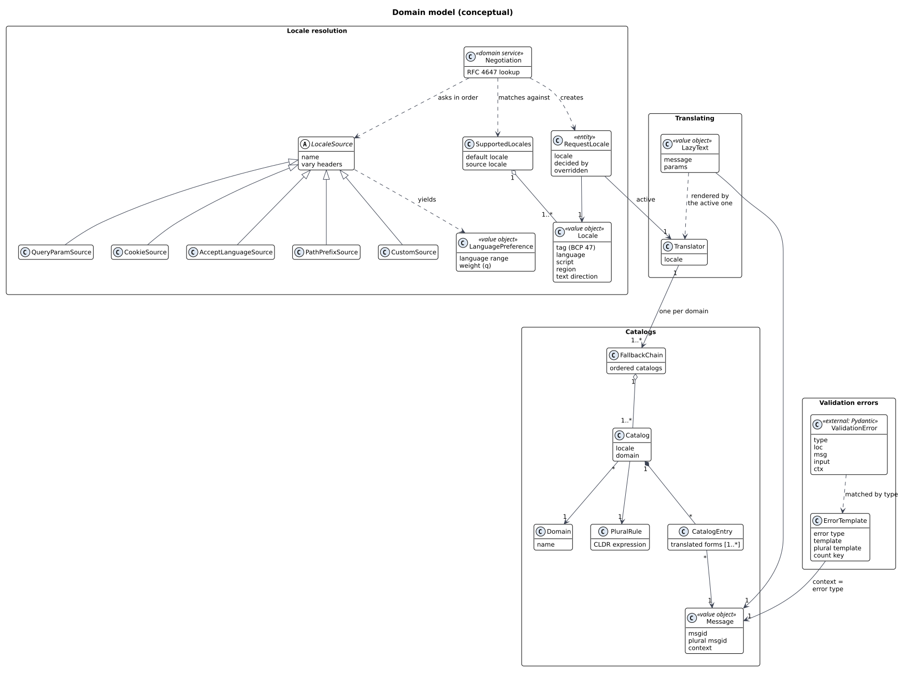
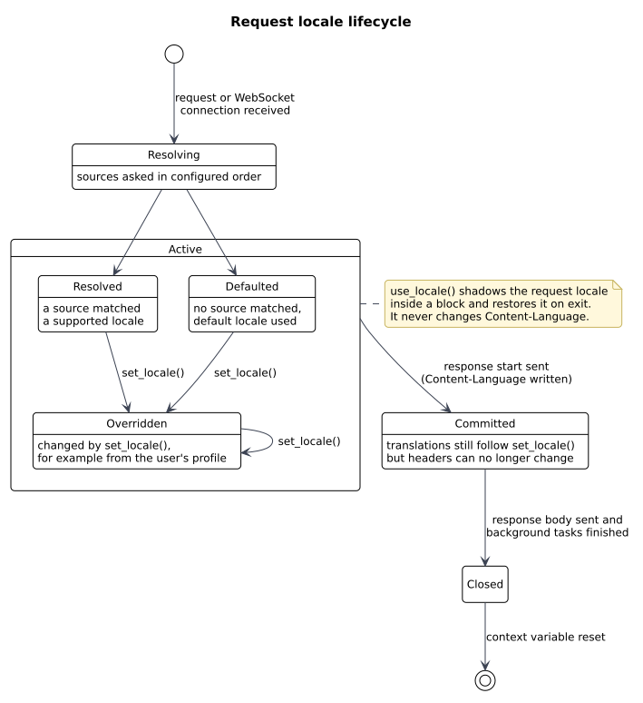
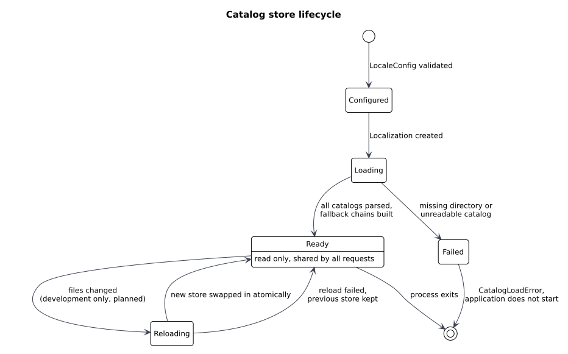

# Domain model

| Field | Value |
| --- | --- |
| Document | Domain model |
| Version | 0.1 |
| Status | Draft for review |
| Owner | Kapil Dagur |
| Last updated | 2026-09-26 |

## 1. Purpose

This document names the concepts fastapi-locale works with, how they relate, and the rules that must
always hold. The same names are used in the code, the docs and the issue tracker, so a term means one
thing everywhere.

## 2. Class diagram

The model has four areas. Each maps to a group of modules in the
[detailed design](../design/detailed-design.md) and can be tested on its own.

| Area | Responsibility | Depends on |
| --- | --- | --- |
| Locale resolution | Decide which locale a request uses. | nothing |
| Catalogs | Hold translated messages and plural rules, loaded once. | Locale resolution (tag rules) |
| Translating | Turn a message into text for one locale, now or later. | Catalogs |
| Validation errors | Map Pydantic error types to translatable templates. | Translating |

## 3. Concepts

### 3.1 Locale resolution

**Locale** (value object). A BCP 47 tag such as `hi`, `pt-BR` or `zh-Hant-TW`, split into language, script
and region. Two locales are equal when their normalized tags are equal. It also knows its text direction,
which clients use to lay out right-to-left languages.

**SupportedLocales**. The set of locales the application serves, plus the default locale and the source
locale (the language msgids are written in).

**LocaleSource**. One place a preference can come from: a query parameter, a cookie, the `Accept-Language`
header, a path prefix, or an application-defined callable. A source returns candidate language ranges in
order of preference and names the request headers it reads, so the response can list them in `Vary`.

**LanguagePreference** (value object). One language range with its weight, as parsed from
`Accept-Language` (`hi-IN;q=0.8`).

**Negotiation** (domain service). Asks the sources in the configured order and matches each candidate with
RFC 4647 lookup: try the full tag, then drop subtags from the end until one is supported.

**RequestLocale** (entity). The locale in force for one request. It records which source decided it and
whether the application changed it later. It lives from the start of the request until the response and
its background tasks are finished.

### 3.2 Catalogs

**Domain**. A named group of messages. The application uses `messages` by default; this library ships its
error messages in its own domain, `fastapi_locale`.

**Message** (value object). The key of a translation: msgid, optional plural msgid, optional context. Two
messages with the same text but different context are different messages ("May" the month and "may" the
verb).

**Catalog**. All translations of one domain for one locale, loaded from one or more `.mo` files. A catalog
carries the plural rule of its language.

**CatalogEntry**. The translated forms of one message in one catalog. A language with three plural forms
has three entries.

**PluralRule**. The CLDR rule that picks the plural form for a number, stored in the catalog's
`Plural-Forms` header.

**FallbackChain**. The ordered catalogs searched for a message in one locale and domain, for example
`pt-BR`, then `pt`, then the default locale. If none has the message, the msgid itself is used.

### 3.3 Translating

**Translator**. Translates messages for exactly one locale, across all domains. One translator is built per
supported locale when catalogs are loaded, and it never changes afterwards.

**LazyText** (value object). A message plus its parameters, translated only when it is turned into a string
or serialized. It lets text be defined at import time, before any locale exists.

### 3.4 Validation errors

**ValidationError** (external). One entry of Pydantic's error list: `type`, `loc`, `msg`, `input`, `ctx`.
The library reads `type` and `ctx` and replaces `msg`. It never changes the other fields.

**ErrorTemplate**. The library's English template for one error type, with named placeholders that match
the keys of `ctx`, an optional plural template, and the `ctx` key that decides the plural form. The error
type is used as the gettext message context, so the same English text can be translated differently for
different types.

## 4. Invariants

These rules hold at all times. Each one is enforced in code and covered by a test.

| ID | Rule |
| --- | --- |
| INV-01 | A request always has exactly one RequestLocale, and its locale is in SupportedLocales. |
| INV-02 | The default locale is in SupportedLocales. |
| INV-03 | Catalogs and translators do not change after loading. Nothing in a request can modify them. |
| INV-04 | Translation never raises because of catalog content. The worst case is the untranslated msgid. |
| INV-05 | A value from the request is used only as a lookup key against SupportedLocales, never as a path. |
| INV-06 | The 422 response keeps FastAPI's shape; only `msg` differs. |
| INV-07 | LazyText equality and hashing depend on the message and parameters, never on the active locale. |

## 5. State machines

### 5.1 Request locale

The locale is resolved once when the request arrives. The application may change it with `set_locale()`
any time before the response is sent (for example after loading the user). Once the response has started,
headers are fixed, but later translations such as those in background tasks still follow the current
value. `use_locale()` is a separate, temporary switch that never changes the request's own locale.

### 5.2 Catalog store

Loading happens once, when the application is set up. A failure stops the application from starting,
which is safer than serving untranslated or partly translated responses without notice. Reloading is a
development feature planned after the first release (CAT-07); it builds a new store and swaps it in, so a
request never sees a half-loaded store.
