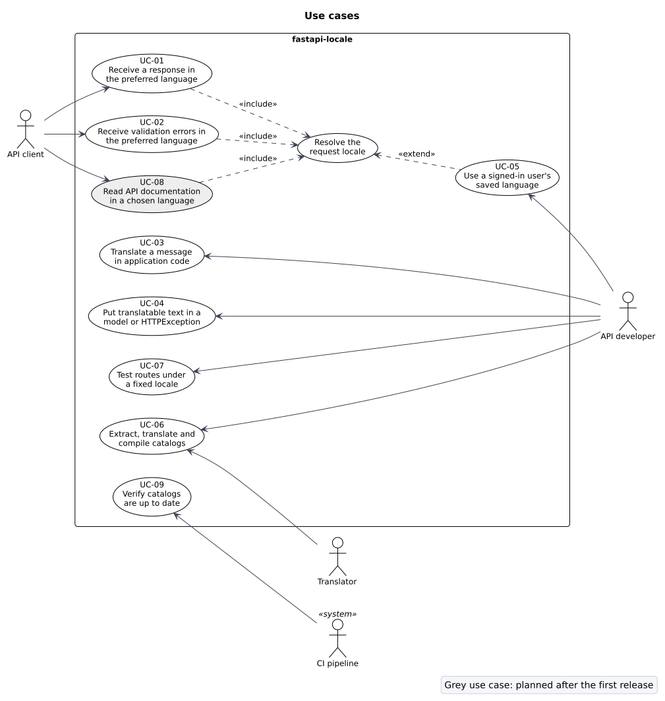

# Use case model

| Field | Value |
| --- | --- |
| Document | Use case model |
| Version | 1.2 |
| Status | Approved |
| Owner | fastapi-locale contributors |
| Last updated | 2026-10-04 |

## 1. Purpose

This document describes how each actor uses fastapi-locale. It expands the use case list in the
[Software Requirements Specification](../requirements/software-requirements-specification.md) (SRS)
section 2.3 into flows that the design and the end-to-end tests can follow step by step.

## 2. Actors

| Actor | Kind | Goal |
| --- | --- | --- |
| API client | Primary, external | Get responses and errors it can show to its user in their language. |
| API developer | Primary | Add localization to a FastAPI service with little code and full test control. |
| Translator | Primary | Translate messages using standard gettext tools. |
| CI pipeline | Secondary, system | Stop a release when translations are out of date or broken. |

## 3. Use case diagram

"Resolve the request locale" is not a goal on its own. It is included by every client-facing use case, and
UC-05 extends it when the application knows the signed-in user's language.

## 4. Use case descriptions

### UC-01 Receive a response in the preferred language

| Item | Description |
| --- | --- |
| Primary actor | API client |
| Preconditions | The application has installed fastapi-locale with a set of supported locales. |
| Trigger | The client sends an HTTP request. |
| Postconditions | The response text is in the resolved locale; `Content-Language` and `Vary` are set. |
| Requirements | LOC-01 to LOC-11, TRN-01 to TRN-04 |

Main flow:

1. The client sends a request with a language preference in a query parameter, cookie or `Accept-Language`.
2. The library asks each configured locale source in order for candidate language tags.
3. The library matches the candidates against the supported locales using RFC 4647 lookup and, when
   that finds nothing, a supported locale in the same language.
4. The library makes the matched locale active for the rest of the request.
5. The route handler builds the response, translating text in the active locale.
6. The library adds `Content-Language` and merges the source headers into `Vary`.
7. The client receives the response.

Alternate flows:

- 3a. No candidate matches. The library uses the default locale and continues at step 4.
- 3b. A candidate is not a valid language tag. The library skips it and tries the next one.
- 5a. A message has no translation in the active locale. The library tries the fallback chain
  (for example `pt-BR`, `pt`, default locale) and finally returns the source text.

### UC-02 Receive validation errors in the preferred language

| Item | Description |
| --- | --- |
| Primary actor | API client |
| Preconditions | As UC-01. The built-in validation exception handler is installed. |
| Trigger | The request fails FastAPI's request validation. |
| Postconditions | A 422 response with the same shape as FastAPI's default, with each `msg` translated. |
| Requirements | ERR-01 to ERR-08 |

Main flow:

1. Steps 1 to 4 of UC-01.
2. FastAPI runs the route's dependencies, then validates the request and collects errors.
3. The validation exception handler reads the active locale.
4. For each error, the handler finds the message template for the error `type`.
5. The handler translates the template and fills its named placeholders from the error `ctx`,
   choosing the plural form from the number the template names.
6. The handler returns the 422 response with only `msg` changed.

Alternate flows:

- 4a. The error `type` has no template (a custom error type). The handler keeps Pydantic's `msg`.
- 4b. The application ships its own translation for the type. It takes priority over the built-in one.
- 5a. The translated template names a placeholder that `ctx` does not have. The handler leaves the
  placeholder as written and logs a warning. The response is still a 422.

### UC-03 Translate a message in application code

| Item | Description |
| --- | --- |
| Primary actor | API developer |
| Preconditions | Catalogs are loaded. |
| Postconditions | The function returns text in the active locale. |
| Requirements | TRN-01 to TRN-06, DI-02, DI-03 |

Main flow:

1. The developer calls `gettext`, `ngettext`, `pgettext` or `npgettext` (or the `d` variants for another
   domain), directly or through the `TranslatorDep` dependency.
2. The library looks up the message in the active locale and formats the named placeholders.

Alternate flows:

- 1a. The code runs outside a request (startup, a script). The library uses the default locale.
- 1b. The code needs another locale for a block, for example an email to a user who reads German. The
  developer wraps the block in `use_locale("de")`.

### UC-04 Put translatable text in a model or HTTPException

| Item | Description |
| --- | --- |
| Primary actor | API developer |
| Preconditions | Catalogs are loaded. |
| Postconditions | The text is translated when the response is serialized, in the locale active at that time. |
| Requirements | LZY-01 to LZY-06, ERR-09 |

Main flow:

1. At import time the developer defines text with `gettext_lazy` (for example a default field value or a
   shared error message).
2. During a request, the route returns a model holding that text or raises `HTTPException` with it.
3. The response is serialized and the lazy text is translated in the request locale.

Alternate flows:

- 2a. The model field is typed `str`. Pydantic rejects the lazy value. The field must be typed `LazyText`
  (documented in the user guide and reported clearly by Pydantic's error).

### UC-05 Use a signed-in user's saved language

| Item | Description |
| --- | --- |
| Primary actor | API developer |
| Preconditions | The application loads the user in a dependency, for example `current_user`. |
| Postconditions | The rest of the request, including 422 errors and `Content-Language`, uses the user's language. |
| Requirements | LOC-13 |

Main flow:

1. The locale is resolved from the request as in UC-01.
2. FastAPI runs the application's `current_user` dependency before validating the request body.
3. The dependency calls `set_locale(user.language)`.
4. Every later translation in the request, the 422 handler and the `Content-Language` header use it.

Alternate flows:

- 3a. The user's language is not supported. `set_locale` falls back through RFC 4647 lookup; if nothing
  matches it raises `UnsupportedLocaleError`, which the application can catch and ignore.
- 3b. Validation fails in a parameter of `current_user` itself, so the dependency never runs. The request
  keeps the locale resolved in step 1. This is a known limit, recorded in ADR-0004.

### UC-06 Extract, translate and compile catalogs

| Item | Description |
| --- | --- |
| Primary actors | API developer, Translator |
| Postconditions | Up to date `.po` files are committed and `.mo` files are built. |
| Requirements | CLI-01 to CLI-03, C-01 |

Main flow:

1. The developer runs `fastapi-locale extract` and the tool writes `messages.pot`.
2. For a new language the developer runs `fastapi-locale init --locale <tag>`; otherwise
   `fastapi-locale update` merges the template into every `.po` file.
3. The translator translates the `.po` file in any gettext tool.
4. The developer commits the `.po` files.
5. The build runs `fastapi-locale compile` to produce `.mo` files.

The activity diagram in the [architecture document](../architecture/software-architecture.md) shows the
same flow with swimlanes.

### UC-07 Test routes under a fixed locale

| Item | Description |
| --- | --- |
| Primary actor | API developer |
| Postconditions | The test runs with the given locale; nothing leaks into other tests. |
| Requirements | TST-01, TST-02, DI-03 |

Main flow:

1. The test uses `localization.override("hi")` (or the pytest marker) around its requests.
2. Every request inside the block resolves to `hi`, whatever headers it sends.
3. On exit the override is removed, including when the test fails.

Alternate flows:

- 1a. The test calls translation functions directly. It uses `use_locale("hi")` instead.
- 1b. The test replaces `current_locale` or `current_translator` through `app.dependency_overrides`.

### UC-08 Read the API documentation in a chosen language

| Item | Description |
| --- | --- |
| Primary actor | API client (usually a person using Swagger UI or ReDoc) |
| Preconditions | Schema localization is on (the default). The application marks its titles, summaries and descriptions with `gettext_noop`. |
| Postconditions | The schema is in the resolved locale; `Content-Language` and `Vary` are set. |
| Requirements | DOC-01 to DOC-05 |

Main flow:

1. The browser opens `/docs`; Swagger UI fetches `/openapi.json` and sends the browser's
   `Accept-Language`.
2. The library resolves the locale as in UC-01.
3. The first request for that locale translates FastAPI's generated schema and caches it; later requests
   get the cached copy.
4. Swagger UI shows translated titles, summaries, descriptions and response texts.

Alternate flows:

- 3a. A text has no translation. It stays in the source language.
- 3b. The route's description comes from its docstring. gettext tools cannot extract docstrings, so it
  stays in the source language unless the route passes `description=gettext_noop(...)`.

The design is in ADR-0009.

### UC-09 Verify catalogs are up to date

| Item | Description |
| --- | --- |
| Primary actor | CI pipeline |
| Trigger | A pull request or a release build. |
| Postconditions | The build fails when catalogs are stale or incomplete. |
| Requirements | CLI-04 |

Main flow:

1. CI runs `fastapi-locale check`.
2. The tool extracts messages into a temporary template and compares it with every `.po` file.
3. The tool reports missing, obsolete and fuzzy entries and files without a `Plural-Forms` header.
4. The tool exits with code 0 when everything is current, 1 when problems were found, and 2 on a usage
   error.
